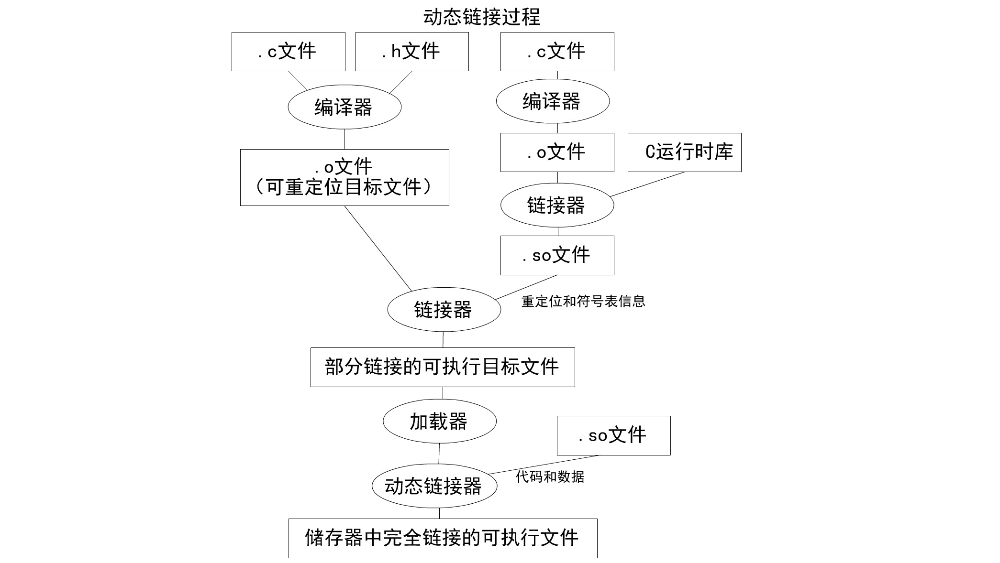

# 热替换技术结题报告

## Abstract

Tiger Fix 是一个在程序运行时动态更改其业务逻辑的热替换项目。它能让应用在无需重新安装的情况实现更新、帮助应用快速建立动态修改能力。报告将首先展示我们的接口，用户可以快速使用我们的技术进行热替换工作。接下来会通过一个很简单的小例子介绍我们的修复流程。之后报告会详细介绍我们的修复方法，首先我们会自动读取修复工作所需的信息，如外部符号、修复函数名等，产生一个中间文件。之后我们使用守护进程 ptrace 目标进程，修改它的程序计数器使他进入 shell 代码段中，执行自我修复工作，此后程序将一直执行更新后的代码；最后我们会给出选择这个方法的原因和它的优点。相信有了Tiger Fix以后，升级将不再是一个令人烦恼的事情了。

## Intruction

### 热部署 (hot deployment) 简介

热部署是指让应用能够在无需重新安装的情况实现更新，帮助应用快速建立动态修改能力。

- 用户总是希望服务进程能保持稳定，如果服务器可以 24 小时工作的话，用户会希望永远不要重启服务器。但是，产品的功能总是在不断的丰富，只要产品仍在生命周期以内，就不可避免会面临版本升级的问题。
- 如果发生大规模的宕机或者运行大型程序时出现问题，通过热部署可以快速修补尽并最大可能的减少损失，而不用重新启动应用。
- 对于移动 APP 等轻型应用，热部署可以能够缩短用户取得新版客户端的流程，改善用户体验，省去用户自行更新客户端的步骤。

总而言之，如果更新过程中，业务进程不用重启，那么这将会极大地方便我们的生产、生活；

### Tiger Fix 接口简介

Tiger Fix 是一个在程序运行时动态更改其业务逻辑的项目，以下简称为tfix。tfix 主要分为两大子模块: gen 和 fix，而用户要进行热修复，需要进行以下三个步骤：

1. 对于用户需要修改的程序（下称目标程序）片段（本项目目前支持以函数为单位的修改），用户将需要修改的代码写在文件里，直接编译生成目标代码(.o文件)

2. 调用 tfix gen 模块。tfix gen 模块在接收以上目标代码的同时，还会分析目标程序的可执行文件的信息，读取目标程序基址，生成 tfix fix 所需的补丁中间文件(.tfp文件)。

   一个标准的使用方法为：

   ```shell
   tfix gen -m main patch patch.o -o patch.tfp
   ```

   

3. 用 root 权限执行 tfix fix 模块。它接收中间文件(.tfp文件)和目标程序的进程 id (pid)，调用了 ptrace  工具来中断进程，修改函数入口处代码，并跳转到新添加的函数。

   一个标准的使用方法为（假设要修复的进程pid为1234）：

   ```shell
   sudo tfix fix 1234 patch.tfp
   ```

   

## Background

### ELF 文件格式

ELF 文件是可执行与可链接格式的英文缩写(英语：Executable and Linkable Format)，这是一种在 Unix 系统用于可执行文件、目标代码、共享库和核心转储(Core Dump)的标准文件格式。我们的项目即是针对ELF文件的热替换。

##### i. 可重定位的对象文件(Relocatable File)

这是由汇编器汇编生成的 .o 文件。后面的链接器拿它作为输入，经链接处理后，生成一个可执行的对象文件 (Executable File) 或者一个可被共享的对象文件(Shared Object File)

##### ii. 可执行的对象文件(Executable File)

很常见，如文本编辑器vi等等。可执行的脚本(如shell脚本)不是 Executable Object File，它们只是文本文件。

##### iii. 可被共享的对象文件(Shared Object File)

这就是所谓的动态库文件，也即 .so 文件。动态库在发挥作用的过程中，必须经过两个步骤：

1. 链接编辑器拿它和其他可重定位对象文件(Relocatable Object File)以及共享对象文件(Shared Object File)作为输入，经链接处理后，生成另外的共享对象文件或者可执行文件。
2. 运行时，动态链接器(Dynamic Linker)拿它和一个Executable File以及另外一些 Shared Object File 来一起处理，在Linux系统里面创建一个进程映像。

在我们的项目中，我们将外壳代码编译为动态库 libtfix.so，通过守护进程的跟踪，目标进程在合适的时机保存状态并跳转到 libtfix.so 中的 do_fix 函数执行自我修复工作，完成修复后恢复原来的状态并执行修复后的代码。我们将修复文件 patch.c 编译为可被共享的对象文件 patch.so，在修复程序中将其动态加载，并修改其 ELF 中对外部变量或函数的引用，修改目标进程 ELF 代码段旧函数的开头部分，使其跳转到 patch.so 动态库中的新函数，完成热替换工作。

ELF 文件大都包含 ELF 头部、程序头部表、节区或段、节区头部表。我们用到了一些重要的段：ELF 代码段是只读的，为了热替换我们必须将其修改，因此我们采用了 mprotect 系统调用的方法。为了解决 patch.so 中对外部变量和函数的引用，在链接时我们指定给这些引用一个特殊的”魔数“ 0xc0ffee，通过读取 ELF 的符号表和 GOT 全局偏移表，我们生成一个中间文件，并在运行时读取这个文件并修改 GOT 表中这些外部引用为真正的地址。我们的项目与 ELF 格式密切相关。

### 动态链接过程

一个程序要想装入内存运行必然要先经过编译、链接和装入这三个阶段。人们考虑将如果两个程序用到相同的函数库，那么理想的情况是系统中只保存一份函数库的拷贝（无论是在内存中还是在硬盘上），于是人们想到了动态链接的方法来实现函数库的复用：动态链接使得两个进程在内存中通过将地址映射到相同的 .o 文件实现对其的共享。动态链接的这一特性对于库的升级（比如错误的修正）是至关重要的。当一个库升级到一个新版本时，所有用到这个库的程序将自动使用新的版本；如果不使用动态链接技术，那么所有这些程序都需要被重新链接才能得以访问新版的库。这样的系统被称作共享库系统。

我们在热部署的实现中正好利用这个特性来实现我们的目的，即如果我们要修改一个函数，我们将新的函数存储在动态链接库中，在修复程序片段中动态加载修复函数对应的动态链接库，然后将旧的函数名重新链接（这是个动态链接过程）到在动态链接库中的函数地址。



### GOT & PLT

GOT 即 Global Offset Table 全局偏移表，PLT 即Procedure Linkage Table 过程链接表，我们的修复过程与他们密不可分。

ELF 共享库使用 PIC 技术使代码和数据的引用与地址无关，程序可以被加载到地址空间的任意位置。PIC 在代码中的跳转和分支指令只使用相对地址。PIC 在 ELF 中建立一个存放所有全局变量指针的全局偏移量表 GOT

- 对于模块外部引用的全局变量和全局函数，GOT 表的表项内容为变量或函数的地址，这样通过这个地址就可以间接访问。
- 对于本模块内的静态变量和静态函数，用相对于 GOT 表的首地址的偏移量来引用，因为模块内的静态变量和静态函数与 GOT 的距离是固定的，且这段距离大小在链接阶段就可知。因此PIC 使用 GOT 来引用变量和函数的绝对地址，把位置独立的引用重定向到绝对位置，与程序被加载到何种地址空间无关。

对于 PIC 代码，代码段内不存在重定位项，实际的重定位项只是在数据段的 GOT 表内。

过程链接表 PLT 用于把位置独立的函数调用重定向到绝对位置。通过 PLT 动态链接的程序支持惰性绑定模式。每个动态链接的程序和共享库都有一个 PLT，PLT 表的每一项都是一小段代码，对应于本运行模块要引用的一个全局函数。程序对某个函数的访问都被调整为对 PLT 入口的访问，每个 PLT 入口项对应一个 GOT 项，执行函数实际上就是跳转到相应 GOT 项存储的地址。

因此，如果我们想在运行时修改一个程序中对另一个程序符号的外部引用（本来程序中的 a 引用了另一个程序的b，现在我们修改它引用那个程序的 c ），我们需要去这个程序的 GOT 表中找到 a 的表项，修改其指向新的符号 c。

不妨设想程序引用了一个可以加载到内存不同位置程序中的一个符号，而且在编译链接时我们并不清楚这个符号的具体地址，这与我们上面那种情况是一样的，通过修改该程序 GOT 表项我们可以手动更新对另一个程序一个符号的引用。

对于程序内部的函数和变量，无论程序被加载到哪里，对它们的引用都是固定的，我们可以不考虑它。

进行热替换的工作不可避免的会带来这个问题：旧函数对一些全局变量和函数的引用无需修改。因为我们将新函数放到动态链接库中，这些符号也必须定义为外部符号。为了使新函数能正确运行，调用函数和引用全局变量，我们必须要修改 GOT 表，所以了解 GOT 是必要的。

## A  Toy Example

在这里，我们从一个最简单的例子开始，意在说明热替换大致的工作流程。尽管很简单，这个例子是我们的项目工作流程的基础。在后面的介绍中我们会看到如何利用这个流程实现一个比较完整、好用的热替换方案。

首先，我们设想我们已经有一个main.c，我们要修改其中的 old_func 为 new_func。我们假设new_func 也写在了 main.c 中，因此无需考虑对全局变量的使用。为了简单快速的说明，我们用某种方式给 main 进程注册一个 SIGUSR1 信号处理函数（比如在main函数中加一个 signal () 调用）

我们设计信号处理函数如下：

```c
void signal_handle(int sig_num){
    if(sig_num == SIGUSR1){
        
        char *p = (char *)old_func;		//旧函数地址
        char *q = (char *)new_func;		//新函数地址
        
        mprotect();			//修改p指针附近内存页可写
        
        *p = (char)0xeb;		//jmp指令操作码
        *(p + 1) = (char)(q - p - 2);	//跳转到新函数，PC相对寻址
        
        mprotect();			//改回p指针附近内存页只读
    }
}
```

这是我们已经实现了一个很简单的热替换，替换的流程是这样的：

1. 我们首先找到main进程进程号，给这个进程发送 SIGUSR1信号
2. 进程调用 signal_handle 函数，自动保存当前状态并跳转到修复代码片段
3. 进程读取旧函数地址和新函数地址（记为p和q）
4. 进程修改旧函数入口处的代码为跳转到新代码
5. 退出信号处理函数，main进程恢复之前的状态，继续执行，完成了替换工作

我们不难看到这里面存在很多问题：

- 我们给进程注册了信号处理函数，并用发送信号的方法控制他跳转到修复代码片段（通过函数调用的方法）。而实际上：
  - 我们很难事先给待修复进程注册信号处理函数，因此不能使用发送信号的方法控制程序进入修复代码片段。我们需要想一个方法控制这个进程进入修复代码片段，比如用一个守护进程 ptrace 它。
  - 我们不能把信号处理函数塞到旧程序的代码段中，同理修复后的函数也不能放到旧程序代码段，我们需要找一个方式存放这些代码，比用用动态链接库。
- 我们认为进程主动调用 signal_handle 函数，自动保存当前状态，而实际上当我们由守护进程控制它进入修复代码片段时，我们可能需要手动保存状态。
- 我们直接读取了旧函数和新函数的地址，而实际上由于新函数保存在动态链接库文件中：
  - 我们需要通过读取 ELF 来找到新旧函数的地址，并进行相应修复。
  - 对于新函数中引用的符号，我们需要定义为外部符号，并修改相应 GOT 表项使其能正确引用。
  - 新函数和旧函数可能相距很远，在64位系统中用 PC 相对寻址可能达不到新函数的位置，如果考虑用寄存器寻址，又要涉及到寄存器的保存与恢复。

尽管存在这样那样的问题，我们还是可以抽象出热替换的基本工作流程：

1. 控制 main 进程进入修复代码片段，并提前保存好现场。（发送信号，进入信号处理函数）
2. 在修复代码片段中获得全局变量、函数的引用信息和新旧函数的地址。（p，q 的获得）
3. 将旧函数入口处替换为对新函数的跳转（mprotect、修改函数入口）
4. 恢复现场，完成热替换（退出信号处理函数）

## Building Blocks of Tiger Fix

在上面的小例子中我们已经看到了热替换大致的工作流程，这里我们将一步一步实现每个步骤。

再开始之前，为了使修复代码片段能获得全局变量、函数的引用信息和新旧函数的地址，我们需要读取 ELF 文件并生成一个中间文件 patch.tfp，记录了这些信息，并将修复后的新程序 patch.so 打包在一起，由修复代码片段读取。第一个模块我们县讨论 patch.tfp 的生成

### patch.tfp 的生成

不妨设想这样一段函数（以下称为旧函数）（位于main.c，以下称为旧程序）：

```c
int old_func (int a) {
    global_data ++;			//修改全局变量
    myFunc ();				//调用其他函数
    do_something_old ();	//做一些事情
}
```

我们想将他修改为这样一段新函数（位于patch.so，以下称为新程序）：

```c
int new_func (int a) {
    global_data ++;			//修改旧程序中的全局变量
    myFunc ();				//调用旧程序中的无需修复的函数
    do_something_new ();	//做一些其他事情
}
```

设想我们将旧函数替换为新函数（修改旧函数入口为跳转到新函数入口），这时 patch.so 对旧程序中全局变量修改和函数的调用必须被正确解决。而旧程序只有在运行时我们才能确定 global_data 和 myFunc 的地址，在编写 new_func 时我们无法确定他们的地址（即使确定，将对 global_data 和 myFunc 的引用替换为对绝对地址的引用也不是一个好的选择，他们在下次执行时很可能会改变）。因此，我们必须在运行时修改 global_data 和 myFunc 而引用正确的符号地址。

考虑到在完成编译后链接的过程中，链接器无法解决 global_data 和 myFunc 这两个外部引用，我们需要链接是给他指定一个值：魔数 0xc0ffee，链接的过程解决了。

利用这个“魔数”，我们也可以用程序读取未解决的外部符号，即新函数中使用的旧程序中的全局变量和函数，从而自动读取他们在旧程序中的地址，以及这些符号在新程序 GOT 表中距离表起始位置的偏移。

在程序运行时，我们利用 GOT 表的起始地址，以及各个待解决符号在 GOT 表中的偏移，可以修改这些符号的 GOT 表项，修改的值则应该是这些符号在 main 进程中的地址，可以是相对地址，可以是绝对地址。

因此，我们在 patch.tfp 中必须给出：相对地址/绝对地址，每个符号在旧程序中的地址、新程序 GOT 表中的偏移，旧函数、新函数的地址。这就需要首先读取 ELF 并生成 patch.tfp。即运行我们的

```shell
tfix gen -m main patch patch.o -o patch.tfp
```

这个进程将会读取 ELF 中值为 0xc0ffee 的符号（即新函数中引用的全局变量、函数的符号），找到这些符号在旧 ELF 中的地址（相对或绝对），以及他们在新程序（动态链接库）GOT 表中的偏移量（运行时修改该 GOT 表）。同时我们读取新旧函数的地址，将这些信息和新程序 patch.so 打包在一起，生成这个patch.tfp。

### ptrace

作为流程的第一步，我们需要控制 main 进程进入修复代码片段，并提前保存好现场，这些可以利用守护进程 ptrace 调用完成。

守护进程首先获得待修复进程 pid，ptrace 这个进程，在下一次系统调用结束时停下这个进程，修改它的程序指针，使其执行修复代码片段 do_fix。

```python
if platform.architecture()[0] == "64bit":
        new_regs.rip = do_fix_entry
        new_regs.rsp = int((new_regs.rsp / 32)) * 32

        process.writeBytes(new_regs.rsp - 4096, patch_path.encode())
        process.writeBytes(new_regs.rsp - 64, str(main_base).encode())

        new_regs.rsp -= 4096
        new_regs.rdi = new_regs.rsp
        new_regs.rbp = new_regs.rsp
```

我们先修改 rip 寄存器（PC）为 libtfix.so 中的修复代码片段起始地址 do_fix_entry，并修改栈指针提供一个安全的活动空间，这时我们向栈空间写入了 patch.tfp 的绝对地址（修复代码片段需要打开它并读取相应信息），并写入 main 程序基址。接着我们修改了栈指针和帧指针到合适的位置，并将栈指针值放入参数寄存器 rdi，由 do_fix 函数接收。

在此之前我们需要完成对寄存器的保存

```python
old_regs = process.getregs()
```

由此我们也可知，我们需要向守护进程传递我们生成的 patch.tfp 的绝对路径和要修复进程的进程号，所以修复工作的接口为

```shell
sudo tfix fix (pid) patch.tfp
```

### do_fix

修复流程的第二步，我们需要在修复代码片段中获得全局变量、函数的引用信息和新旧函数的地址，这个可以读我们生成好的 patch.tfp 得到，而 patch.tfp 的地址已经放在了栈中，栈的指针已经放到了参数寄存器 rdi 中。因此，很自然地，我们的 do_fix 函数接收一个参数，得到栈指针，并利用它得到 patch.tfp 的绝对路径，从而读取相应符号的信息。

```c
static __attribute_noinline__ __attribute_used__ void do_fix(void *uesp) {
    const char *path = (char *)uesp;
    ...
```

### 修改外部引用

修复流程的第三步之前，我们注意到 patch.so 对外部符号的引用还是 0xc0ffee，没有得到正确的地址，因此在第三步之前我们需要修改 patch.so 对外部符号的引用。

在前面已经讨论过，此时我们用从 patch.tfp 读到的信息，计算 GOT 表起始地址和各个符号在 GOT 表中的偏移量之和得到 GOT 表项，修改其值为对应符号在旧程序中的地址。这样在修复后的函数中对旧程序中的全局变量的引用和其他函数的调用就可以正常进行。

修改 GOT 表时，由于内存页的保护措施，我们可能需要修改对应页面的可写属性，用 mprotect 系统调用即可：

```c
 mprotect(pg, pagesize, PROT_READ | PROT_WRITE | PROT_EXEC);
```

这条指令会将 pg 对应的页面设置为可读、可写、可执行。

### 修改函数入口

修复流程的第三步，将旧函数入口处替换为对新函数的跳转。考虑到 64 位机器上使用 PC 相对寻址可能不够用，我们不得不使用寄存器跳转，这就涉及到保存和恢复寄存器的值。因此，我们把旧函数入口几个字节修改为（代码段只读，需要mprotect）：

```assembly
push %rax
movq %0xc0ffee,%%rax
jmpq *%rax
nop
```

总共 16 个字节。最后的 nop 用于对齐。

我们先保存 rax 寄存器的值，放到栈上，然后将新函数地址（已经不是 0xc0ffee，前面修改了）放到 rax 中，寄存器寻址跳转。这就解决了长跳转的问题，对于寄存器保存在栈上，这就要求用户在编写修复后的新函数时必须首先 pop rax。为了解决这个问题我们进行了封装，用户只需要写上

```c
FIXFUN(new_func)
int new_func(int a){...}
```

即可在 new_func 执行前自动 pop rax 恢复寄存器的值。这个宏定义的内容也正是一段汇编 pop rax 并跳转到 new_func

关于为什么不在 new_func 开头加上汇编 pop rax，这是因为编译器会自动在函数开头加一些其他指令（如调整栈、栈帧、参数），为了保证 pop rax 在函数的一开始执行不能这样做。

### 修复过程结束

修复流程的第四步，恢复现场，完成热替换。这里采用的方法是：当修复代码片段 do_fix 执行结束后，main 进程会执行一个 

```assembly
int 0x3
```

产生中断，这时守护进程通过 ptrace 从等待态返回到就绪态并可以继续。

守护进程会恢复寄存器的值，即恢复现场，同时也恢复了原来的 PC。之后守护进程通知 main 进程继续，守护进程退出，至此修复过程结束。

### 总结

tfix 首先调用 ptrace 将函数中断，然后找到原函数入口地址，将其开头的字节替换为以下汇编代码：

```assembly
push rax 						   	;(暂时保存 rax 寄存器的值)
mov 新函数入口地址 rax	 				;（将新函数地址存入 rax 寄存器)
jmp rax								;（跳转到新函数）
```

还要修改动态链接库对原程序外部符号的引用，通过符号在 GOT 表中的偏移修改 GOT 表项的 0xc0ffee为符号在原程序中的实际地址。

同时，我们以调用动态链接库 (dlopen) 的形式加载用户提供的目标文件。（注意到 dev.h 头文件通过宏定义的方式使得用户的提供的新函数入口处第一条指令为为`pop rax`，这样能恢复 rax 寄存器）

当完成这些步骤后，将控制权返回给程序，程序继续执行。

这样每当该被修复的函数被调用时，PC指针会先跳转到旧函数地址，然后通过这些添加进来的指令跳转到新的函数地址，完成了函数的替换。这样，热修复就完成了。


## Tiger Fix

### (1) 用户对源码的变动

用户原项目代码需要包含头文件 #include <tigerfix/def.h>，用于修复原代码的补丁代码需要包含头文件 #include <tigerfix/dev.h>

同时，用户需要将补丁代码中的所有外部符号引用（包括外部变量和外部函数调用）用 extern 声明。

其中，dev.h 头文件用宏定义的方式来声明一个外部符号 fix_func （其中func为宏接收的参数，即需要修复的函数名称）。该符号下接两条汇编指令：

1. pop rax （用于将之前受到影响的 rax 寄存器恢复现场）
2. 跳转到新函数地址的跳转指令

同时，编译源码时候将外部符号指向的地址人为规定为魔数 0xc0ffee（该魔数起到了占位符的作用）

### (2) 补丁中间文件的生成

我们需要第一步中由用户生成的目标代码，和欲修复进程的可执行文件这两个文件，通过组合这两个文件来生成补丁的中间文件。

如何生成目标代码已经涉及过了，下面来介绍我们需要读取可执行文件中的哪些信息。

主要有以下信息：

1. 可执行文件的寻址方式（是相对寻址还是绝对寻址）
2. 旧函数的地址 和 新函数的地址
3. 外部变量（如全局变量）的地址 和 外部变量在 GOT 表中的项
4. 外部函数的地址 和 外部函数在 GOT 表中的项

### (3) 修复

修复过程主要由两个进程主导：

1. fix.py 
2. libtfix.so

#### fix.py

1. 从 /proc/$(pid)/maps 中读取欲修改进程的基地址。
2. 使用 ptrace 追踪待更新的进程，并在下一次系统调用结束的时候暂停欲修改进程。
3. 暂存所有寄存器的值
4. 将欲修改进程的 rip 寄存器（PC）修改为 libtfix.so 中的 do_fix_entry 地址（该地址是执行修改进程一系列操作的函数的入口地址）
5. 将补丁中间文件的文件地址和欲修改进程的基地址压栈，同时将栈指针放到 rdi 参数寄存器中
6. 此时，让进程继续执行

当进程继续执行时，会跳转到 libtfix.so 的地址，开始执行 do_fix_entry 的内容

#### libtfix.so

1. 通过参数寄存器，读取栈指针，并通过栈指针读取中间文件的文件地址和进程的基地址。
2. 提取出中间文件的信息和补丁目标文件
3. 通过 dlopen 将补丁目标文件加载到内存中
4. 修改补丁目标文件的GOT

#### 修改补丁目标文件GOT的步骤

1. 寻找GOT中所有值为 0xc0ffee 的项（意味着这些项将被修改）
2. 读取欲修改进程的符号表，参考符号表来修改补丁目标文件的GOT

## Evaluation

在这里，我们将给出一些其他可能的方案、我们选择这个方式的原因、它们的优缺点、以及我们的一些限制和测试用例。

### 获取工作进程控制权的一些方案

##### 内核态的解决方案

在内核中，用中断的方式抢占进程的控制权。在内核态对程序执行相关更新操作后，再将控制权交还给程序。这种做法的**优点**在于**安全**和**高效**，因为代码段默认是不可写的，所以我们需要先更改代码段的读写属性，接着修改代码段内容，再把代码段改回不可写的状态。所以，直接在内核态里完成这些工作可以节省一些系统调用的开销，还可以保证修改代码操作的原子性和程序执行的安全性。

##### 用户态的解决方案

- 调试器原理：软中断 (在 x86 上是 INT 3)

  调试器在给一个被调试程序打断点时，先保存断点处的指令，然后用 INT 3 指令去替换原有代码的指令。程序执行到 INT 3 时，操作系统会给调试器发信号。调试器在接收到信号之后会执行以下流程

  - 将 INT 3 改回原来的指令
  - 将代码寻址寄存器回滚一个字节
  - 允许用户和调试器进行交互（读取数据，加新的断点之类）
  - 如果继续执行，调试器会把 INT 3 再填回去，除非用户要求删除断点

  我们可以借鉴调试器的方式，通过软中断获取工作进程的控制权。这种方法的优点是可以**精确**地在某些地址停下来，这对热部署有重要意义。为了更新的安全性，我们通常不希望程序在任意时刻被中止，然后更新。我们希望程序在某些安全的时间节点停下来接收更新，所以软中断的方法可以很好的解决这个问题。软中断的缺点也很明显，它对**效率**的影响非常大。

- 虚拟机接管控制流

  和动态语言类似，我们也可以造一个虚拟机，让每一次函数调用都由虚拟机来处理。这种动态寻址方案优点是**灵活性好**，缺点是**效率不高**，而且**实现比较困难**，尤其是对已经编译好的二进制代码。

  虚拟机和工作进程之间的连接并不是一件轻松的事情，因为工作进程有自己的完整控制流，而且我们假设工作进程并未预先为虚拟机设计通信接口。如果像真正的虚拟机那样对工作进程进行解释，那么它的效率将是我们完全无法忍受的。一个可行的解决方案是，在每次函数调用时，将调用的目标函数地址压栈，并跳转到虚拟机里的控制函数，由虚拟机来处理这次函数调用。

- 信号处理函数获得控制流

  我们可以给工作进程加壳（即给可执行文件增加一些代码），并且这些代码可以在main函数之前执行。在执行“壳”代码时，可以给工作进程注册一些信号处理函数。当需要获得控制流时，外部程序就给工作进程发信号，这时，进程执行中断，进入信号处理函数，这样就达到了获取控制流的目的。通过信号处理函数来获得控制流的方法优点是**执行效率**比较高，缺点是收到信号时停下来的**断点分布**很随机，不一定是我们想要的点。

  我们的 toy example 即采用的类似这种方法。

### 代码的修改方案

##### 整段替换

一个比较简便的方法是将工作进程的代码段整段替换为新的代码，或者将整段函数替换为新的代码，这样做是**不可行的**。

首先，工作进程正在执行的指令不确定，如果将代码段整段替换，将引起无法预知的错误。例如，如果进程正在执行函数递归，整段替换代码后进程的执行进入未知状态，无法继续控制，这是绝对不可行的。

其次，考虑将函数整段替换的方法。即使可以保证替换时机合适，即该函数未在栈中时进行替换，如果新的代码长度超过了原有代码，那么这也是不可行的。其一，原有的可执行文件的代码段可能将无法容纳新的代码，无法做到整段替换。其二，整段替换代码可能需要调整后续代码的内存地址，进而需要调整所有用到直接寻址、寄存器寻址等的指令，还可能需要更新符号表等更多内容。效率低、操作复杂。

##### 新增代码

另一种方法是将新函数作为新增的代码。在原代码调用被替换函数时跳转到新的函数入口，函数执行完成后返回到被替换函数返回的地址。这种方法**可行**。

以下将被替换的函数称为旧函数，新增的函数代码称为新函数。

- 旧函数入口处跳转

  将旧函数函数体的第一条指令改为跳转指令，跳转到新函数的入口地址。这样做会使每次调用函数时，先jump到旧函数的入口地址，再jump到新函数的入口地址，最后返回到相应的位置。这是一个**简单、通用**的做法，但是**效率低**，而且**对cache不友好**。考虑一种情况，如果我们三次更新同一个函数，不妨称之为函数1、2、3，那么每次调用这个函数会从先跳转到旧函数，之后跳转到函数1，之后函数2，最后函数3，执行并返回，而旧函数和函数1、2、3很可能位于内存不同的页上，这就违反了空间局部性的原理，必定会造成低效、对cache不友好。

- 在函数调用位置跳转

  将跳转到旧函数的指令直接修改为跳转到新函数。要分为以下几种情况。

  - 如果跳转指令采用直接寻址的方式，这样只需要将地址改为新函数的地址即可。
  - 如果跳转指令采用寄存器寻址、间接寻址等方式，会有些麻烦。出现这种情况可能的原因比如，使用了函数指针进行函数调用，如果汇编指令是 jump register，这时只有在执行到了这条指令时才能确定要跳转的位置，即register的值，是不是旧函数的地址，而在执行之前很难确定，所以很难实现在函数调用位置跳转。

  这样做总体来说效率更高，为了避免寄存器寻址引发的麻烦可以与第一种方法“旧函数入口处跳转”一起使用，可以**提高效率**。

- 由虚拟机控制跳转

  对于第一种方式“旧函数入口处跳转”，跳转需要两次，而第二种方法能优化第一种方法，那么就自然想到可以用虚拟机控制跳转，即调用旧函数时先跳转到虚拟机的控制部分，由虚拟机决定是否跳转到新函数还是其他函数，这样也是跳转两次，但是相比第一种方式，虚拟机可以从中**获得控制权**，从而更易控制代码的修改、断点的设置等等；**灵活性更高**，可以方便灵活的切换函数。但是与第一种方式同样，**效率低**。

- 代码全面重排

  为了解决效率问题，还有一种策略就是将代码全面重排。使用前三种方法进行热更新，都是新增代码的方法，新增代码就必然会打破程序的空间局部性。为了使前三种方式能获得更高的效率，考虑可以使用 mmap 系统调用的方法，将代码放入 mmap 的空间中全面重排。按照时间局部性和空间局部性原理，将修改后的代码，对于经常被调用的函数，调用者和被调用函数尽可能放在临近的内存空间中，结合前三种方式实现动态更新。这样做对前三种方式都在一定程度上**提高了效率**，但是非常**繁琐**，程序中所有含有寻址的指令都要进行修改，代价较大，**不易实现**。

### 我们的方案

- 工作进程控制权的获取：我们采用了 ptrace 的方案，通过守护进程跟踪工作进程，从而获取它的控制权。
  - 优点：安全可靠、可以控制更新时机、便于我们向修复代码片段传递信息
  - 不足：修改旧代码时需要进行系统调用，ptrace 需要 root 权限
- 代码的修改：我们将新增函数编译为一个动态链接库，在旧函数入口处修改为跳转到新函数。
  - 优点：简单、安全（不用大面积修改工作进程的代码段）、易于实现、成功率高
  - 不足：效率较低、可能不满足局部性原理、对 cache 不够友好

### 我们的限制

##### 对更新模块的限制

我们可以将各个模块分类，分为 **无状态模块** 和 **有状态模块**。**无状态模块** 的定义是，该模块的执行结果（输出）仅仅与模块当前输入有关，而与模块的执行历史无关。也就是说，无论模块之前进行了什么操作，都不会影响到现在模块的输出结果。许多数据处理应用的算法都是属于 **无状态模块**。例如：数据清洗操作（将固定格式的字符流数据转化为包含一定数据结构的结构化数据），并行矩阵乘法（在神经网络的高性能计算中属于性能瓶颈之一）

当热部署需求是修改 **无状态模块** 时，热部署的实现将变得相对容易。我们仅仅需要将程序执行的对应模块在合适的时间点进行替换，而不用考虑模块中内部状态的影响。目前解决修改 **无状态模块** 的方案主要是将模块置于动态链接库内加载，如 Windows 操作系统中的`.dll`文件，和 Unix 操作系统的 `.so` 文件。

另一方面，某些模块是拥有内部状态的，这些模块的执行结果除了与当前输入数据有关，还会与模块内部储存的一些状态有关，这些模块我们称它为 **有状态模块**。一个 **有状态模块** 的最简单的例子是一个计数器模块：每次调用该模块，会输出被调用次数。这样，我们尽管每次同样调用同一个模块，它的输出结果却不尽相同（每次输出结果都比上一次的输出结果多1）。

对于这些 **有状态模块** 而言，为了实现热部署的功能，我们并不能像之前提到的 **无状态模块** 一样处理。如果我们简单地像之前那样，通过动态链接库进行替换，那么这些 **有状态模块** 中的状态就会丢失。还是举计数器的例子：当我们需要对计数器进行更新时，如果是简单地替换掉计数器当前的代码，那么计数器记录的次数就会丢失。这对于某些生产环境是不可接受的严重后果，特别是对于一些庞大且重要的系统，如银行，电信运营商，高铁调度系统等。这些系统一旦发生某些状态数据丢失，会造成巨大的经济损失，甚至造成人员伤亡等。

因此，为了避免状态的丢失造成各种数据丢失乃至经济财产损失，我们的一个基本要求就是用户在提供热部署的更新补丁时，这些更新必须是无状态模块。

这些无状态模块在编程语言中主要有四种具体形式：

- 更改函数
- 增加函数
- 更改全局变量
- 增加全局变量

##### 对体系架构和环境的限制

因为我们的项目与 ELF 结构高度相关，目前我们的项目只能运行在 Linux 系统中。我们对源代码的修改使用了 x86 汇编，目前只能支持 x86 的 64位或32位系统。

- Linux 系统
- x86 指令集 64位/32位？？？

## Discussion

## Acknowledgement

## Reference

[1] Chopra, Shelesh, et al. "Automated hotfix handling model." U.S. Patent No. 8,713,554. 29 Apr. 2014.

[2] 杨广翔. ELF格式可执行程序的代码嵌入技术[J]. 程序员, 2008, (3): 104-106

[3] winner_0715. HotSwap和JRebel原理[EB/OL]. https://www.cnblogs.com/winner-0715/p/5136489.html.